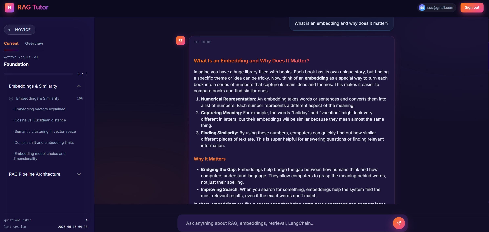
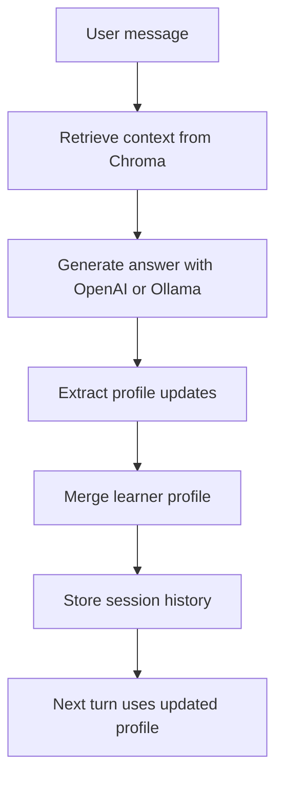
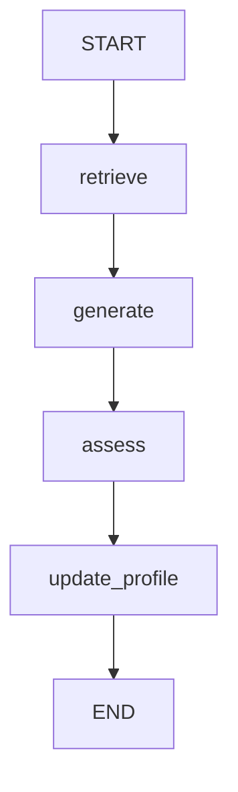

# RAG From Scratch

I built this project because I wanted to understand RAG beyond the happy-path
tutorial version.

Not just "embed a document and ask a question," but the parts that make an AI
system feel real: retrieval quality, session state, user adaptation, fallback
behavior, service health, caching, and the discipline of making each step
observable.

This repo is an adaptive RAG learning agent. It retrieves from a small knowledge
base, answers with an LLM, updates a learner knowledge profile during the
session, and then uses that updated profile on the next turn.

The goal is simple: make the system readable, runnable, and honest about how the
pieces fit together.



## Table Of Contents

- [What It Demonstrates](#what-it-demonstrates)
- [Run The Demo](#run-the-demo)
- [Run The Docker App](#run-the-docker-app)
- [Demo Flow](#demo-flow)
- [Architecture](#architecture)
- [State And Profile](#state-and-profile)
- [For Interviewers](#for-interviewers)
- [Infrastructure](#infrastructure)
- [Tests](#tests)
- [Project Structure](#project-structure)
- [Next Improvements](#next-improvements)

## What It Demonstrates

- Chroma vector retrieval over local markdown documents
- OpenAI generation with Ollama fallback
- local Hugging Face embeddings when OpenAI is unavailable
- realtime learner-profile updates across a session
- profile-aware answer generation
- LangGraph-style stateful agent architecture
- Redis caching, circuit breakers, health checks, and metrics
- Dockerized local infrastructure for the full app stack

## Run The Demo

Install dependencies with `uv`:

```bash
uv sync
```

Copy the environment template:

```bash
cp .env.example .env
```

Run the standalone terminal demo:

```bash
uv run rag-demo
```

The demo chooses a model path at startup:

- with a valid `OPENAI_API_KEY`: OpenAI embeddings + OpenAI generation
- with no key or an invalid key: local embeddings + Ollama generation
- with `DEMO_FORCE_OLLAMA=true`: Ollama path no matter what

To force the local fallback path:

```bash
DEMO_FORCE_OLLAMA=true uv run rag-demo
```

For Ollama fallback, start Ollama and pull the configured model:

```bash
ollama pull gemma3:4b
```

If you do not want to run OpenAI or a local Ollama model, read the pasted
transcript in [docs/demo-scenario.md](docs/demo-scenario.md#sample-transcript).
It shows the same Chroma retrieval, generation, profile update, and profile
reuse flow.

## Run The Docker App

The standalone demo is the fastest way to see the RAG/profile loop. The Docker
stack runs the fuller application infrastructure: FastAPI/NiceGUI, Chroma,
Redis, Ollama, and optional monitoring.

Start from the environment template:

```bash
cp .env.example .env
```

For the **OpenAI-backed Docker path**, set these values in `.env`:

```env
OPENAI_API_KEY=your_real_key
LLM_PROVIDER=openai
EMBEDDING_PROVIDER=openai
OPENAI_MODEL=gpt-4o-mini
OPENAI_EMBEDDING_MODEL=text-embedding-3-small
```

Then run:

```bash
docker compose up --build
```

Open the app:

```text
http://localhost:8000
```

For the **fully local Docker path**, use Ollama for generation and local
embeddings:

```env
OPENAI_API_KEY=
LLM_PROVIDER=ollama
EMBEDDING_PROVIDER=local
OLLAMA_BASE_URL=http://ollama:11434
OLLAMA_MODEL=gemma3:4b
```

Start the stack, then pull the model into the Ollama container:

```bash
docker compose up --build
docker compose exec ollama ollama pull gemma3:4b
```

If the app started before the model was pulled, restart it:

```bash
docker compose restart app
```

Useful checks:

```bash
curl http://localhost:8000/api/health
curl http://localhost:8000/api/health/ready
curl http://localhost:8000/api/health/circuit-breakers
```

Run the optional monitoring stack:

```bash
docker compose --profile monitoring up --build
```

## Demo Flow

The terminal demo runs three turns:

1. The user knows basic RAG and asks why LangGraph is useful.
2. The assistant reuses the profile without inventing new profile changes.
3. The user switches to LangChain and asks for a game-like explanation, causing
   the profile to update.

The transcript exposes the important internals:

```text
Retrieved context from Chroma:
- LangGraph State Machines for RAG (...)

Knowledge profile before update:
- prior_knowledge: understands basic RAG
- current_interest: LangGraph state machines
- communication_style: prefers concise explanations

Knowledge profile after update:
- prior_knowledge: understands LangGraph state machines
- current_interest: LangChain chains
- communication_style: prefers game-like explanations
```

## Architecture



The full app uses LangGraph for the agent workflow:



## State And Profile

The application graph state lives in [src/agents/state.py](src/agents/state.py).
The important idea is that the agent carries an explicit state object through
the graph instead of hiding everything inside one prompt.

Core state fields include:

- `messages`: conversation messages managed by LangGraph
- `question`: current user question
- `docs`: retrieved documents
- `answer`: generated answer
- `topic_scores_delta`: per-turn mastery/profile signal
- `identified_gaps`: topics where the user may need help
- `session_question_counts`: per-topic session counters
- `gate_just_passed`: progression event for the UI

The demo mirrors this idea in a smaller form: retrieve context, answer, profile
before update, profile updates, profile after update, and session history.

## For Interviewers

Start here:

- [src/rag_from_scratch/demo.py](src/rag_from_scratch/demo.py) - runnable end-to-end demo
- [src/agents/graph.py](src/agents/graph.py) - LangGraph state machine assembly
- [src/agents/state.py](src/agents/state.py) - graph state schema
- [src/agents/nodes/retrieve.py](src/agents/nodes/retrieve.py) - retrieval node contract
- [src/agents/nodes/generate.py](src/agents/nodes/generate.py) - profile-aware generation node
- [src/agents/nodes/update_profile.py](src/agents/nodes/update_profile.py) - profile persistence node
- [src/rag/pipeline/retriever.py](src/rag/pipeline/retriever.py) - Chroma retrieval with BM25 fallback
- [src/rag/resilience/circuit_breaker.py](src/rag/resilience/circuit_breaker.py) - circuit breaker state machine

The highest-signal behavior is the demo's profile loop: the system retrieves,
answers, updates profile state, and then changes the next answer based on that
state.

## Infrastructure

The repo has two runtime shapes:

- **Standalone demo:** runs from the local Python process, creates a local Chroma
  index under `data/demo_chroma_db/`, and chooses OpenAI or Ollama at startup.
- **Docker app stack:** runs FastAPI plus the supporting services needed for the
  full application.

### Docker Services

`docker-compose.yml` defines the local service stack:

| Service | Purpose |
|---|---|
| `app` | FastAPI/NiceGUI application, LangGraph agent, API routes, startup ingestion |
| `chroma` | Persistent vector database for semantic retrieval |
| `redis` | Cache backend for query, embedding, and LLM response layers |
| `ollama` | Local LLM runtime used as the cloud fallback/local path |
| `prometheus` | Optional metrics scraper, enabled with the `monitoring` profile |
| `grafana` | Optional dashboards, enabled with the `monitoring` profile |
| `elasticsearch` | Optional log storage for the monitoring stack |
| `logstash` | Optional log ingestion pipeline |
| `kibana` | Optional log exploration UI |

Run the core app stack:

```bash
docker compose up --build
```

Run with monitoring services:

```bash
docker compose --profile monitoring up --build
```

The local compose file exposes:

- API/UI: `http://localhost:8000`
- Chroma: `http://localhost:8001`
- Redis: `localhost:6379`
- Ollama: `http://localhost:11434`
- Prometheus: `http://localhost:9090` when monitoring is enabled
- Grafana: `http://localhost:3000` when monitoring is enabled
- Kibana: `http://localhost:5601` when monitoring is enabled

`docker-compose.prod.yml` shows a production-style deployment shape:
Chroma, Redis, Prometheus, Elasticsearch, Logstash, Kibana, and Ollama are
internal-only with `expose`, while the app and Grafana are externally published.

### Startup Flow

On FastAPI startup, [src/app/main.py](src/app/main.py) performs the operational
boot sequence:

1. Initialize SQLite auth/profile tables.
2. Seed the admin user.
3. Load markdown knowledge-base documents.
4. Build the in-memory BM25 fallback retriever.
5. Check Chroma and ingest documents if the collection is empty.
6. Compile the LangGraph graph with a `MemorySaver` checkpointer.
7. Start background dependency health probes.

That startup path means the application can still answer with degraded retrieval
when Chroma is unavailable, because BM25 is loaded before requests are served.

### Redis

Redis is used as the application cache layer. The environment controls cache
lifetimes:

- `CACHE_TTL_QUERY`: exact query/answer cache
- `CACHE_TTL_EMBEDDING`: text-to-vector cache
- `CACHE_TTL_LLM`: prompt-to-response cache

The compose stack runs Redis with append-only persistence:

```text
redis-server --appendonly yes
```

### Circuit Breakers

The app has circuit breakers for Chroma, OpenAI, and Redis in
[src/rag/resilience/circuit_breaker.py](src/rag/resilience/circuit_breaker.py).
Each breaker has three states:

- `CLOSED`: service is healthy; requests flow normally
- `OPEN`: repeated failures crossed the threshold; avoid the failing service
- `HALF_OPEN`: recovery window elapsed; allow a probe request

The configured thresholds are:

- `CB_FAILURE_THRESHOLD`: failures before opening
- `CB_RECOVERY_TIMEOUT`: seconds before a half-open recovery probe

Where fallbacks apply:

- **Retrieval:** Chroma failure routes retrieval to the BM25 fallback retriever.
- **Generation:** OpenAI failure can route generation to Ollama when the breaker
  is open. The standalone demo also catches OpenAI auth failures and immediately
  reroutes to Ollama.
- **Health:** `/api/health/circuit-breakers` exposes breaker state.

### Local vs Cloud

The project intentionally supports both cloud and local operation:

| Layer | Cloud/default path | Local/fallback path |
|---|---|---|
| Chat generation | OpenAI chat model | Ollama, default `gemma3:4b` |
| Embeddings | OpenAI `text-embedding-3-small` | Hugging Face `all-MiniLM-L6-v2` |
| Vector store | Chroma service in Docker | Local demo Chroma index |
| Cache | Redis service | Redis service in Docker |
| App state | LangGraph `MemorySaver` per app lifetime | Same |

OpenAI embeddings and local Hugging Face embeddings use different vector
dimensions, so the standalone demo stores separate Chroma indexes per backend:

```text
data/demo_chroma_db/openai/
data/demo_chroma_db/ollama/
```

### Health And Observability

Operational endpoints:

- `GET /api/health`: liveness
- `GET /api/health/ready`: live Redis and Chroma readiness probe
- `GET /api/health/services`: cached dependency snapshot from the background probe
- `GET /api/health/circuit-breakers`: Chroma/OpenAI/Redis breaker states
- `GET /metrics`: Prometheus metrics

Prometheus metrics include:

- request counts and latency
- cache hits and misses
- chunks retrieved per query
- LLM call counts by provider/status
- circuit breaker state gauges

## Tests

Run the active portfolio suite:

```bash
uv run pytest -q
```

The active tests focus on the current architecture: demo import/contracts,
bundled sample docs, LangGraph graph assembly, retrieval fallback behavior,
profile-update guardrails, and API health routes.

Older commit-gate tests are kept in the repository as development history, but
the default pytest path is intentionally scoped to `tests/active/` so stale
contracts do not hide the current signal.

## Project Structure

```text
src/
  agents/              LangGraph state, graph assembly, and nodes
  rag/                 retrieval, indexing, embeddings, providers, resilience
  app/                 FastAPI routes, UI, auth, profile, health, metrics
  rag_from_scratch/    standalone demo entry point
data/
  sample_docs/         small public docs used by the demo
  knowledge_base/      app knowledge base loaded at startup
monitoring/            Prometheus, Grafana, Logstash configuration
```

## Next Improvements

- persist LangGraph checkpoints outside process memory
- add automated evals for retrieval quality and profile extraction
- stream the demo transcript token-by-token
- add `DEMO_MOCK_LLM=true` for reviewers who want the full flow without OpenAI
  or Ollama installed
- add a small browser UI for the standalone demo path
- harden the production-style compose stack with TLS and secured Elasticsearch
